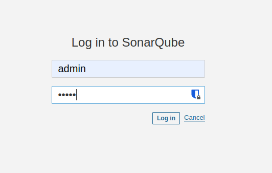
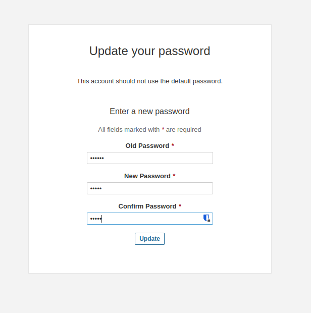
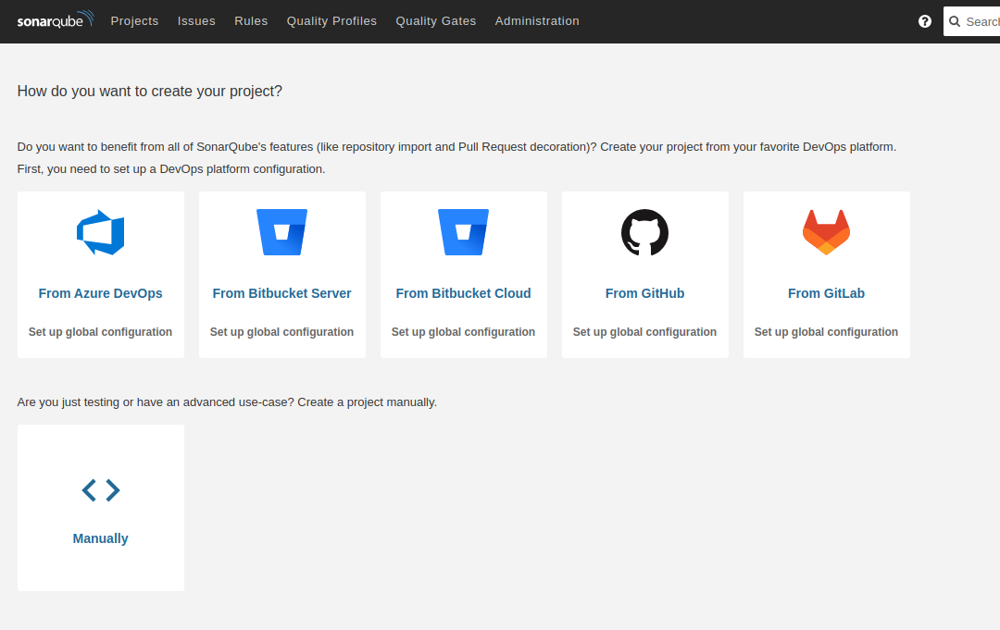
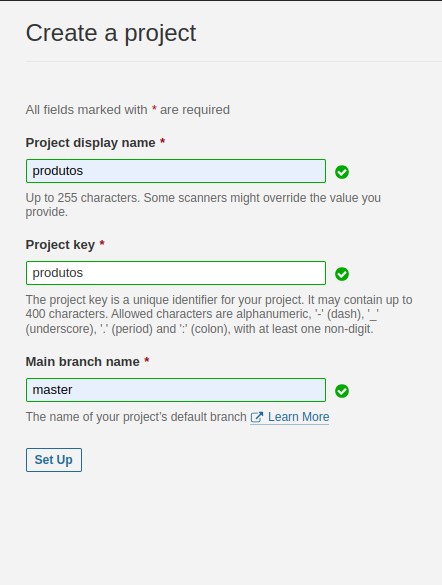
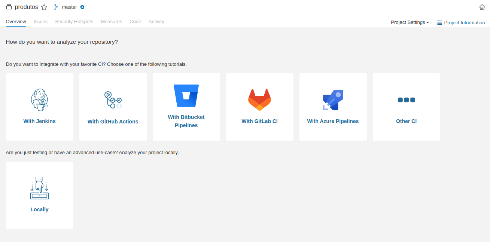
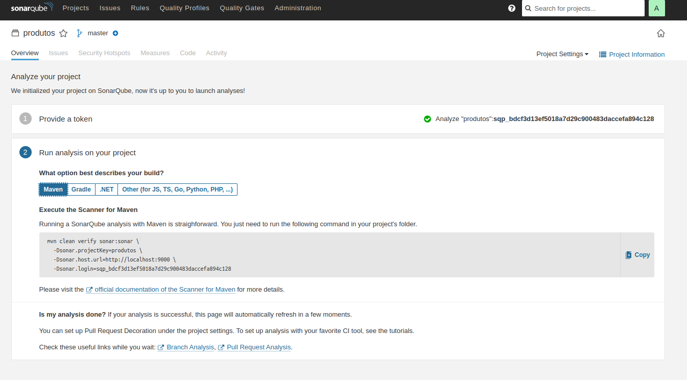
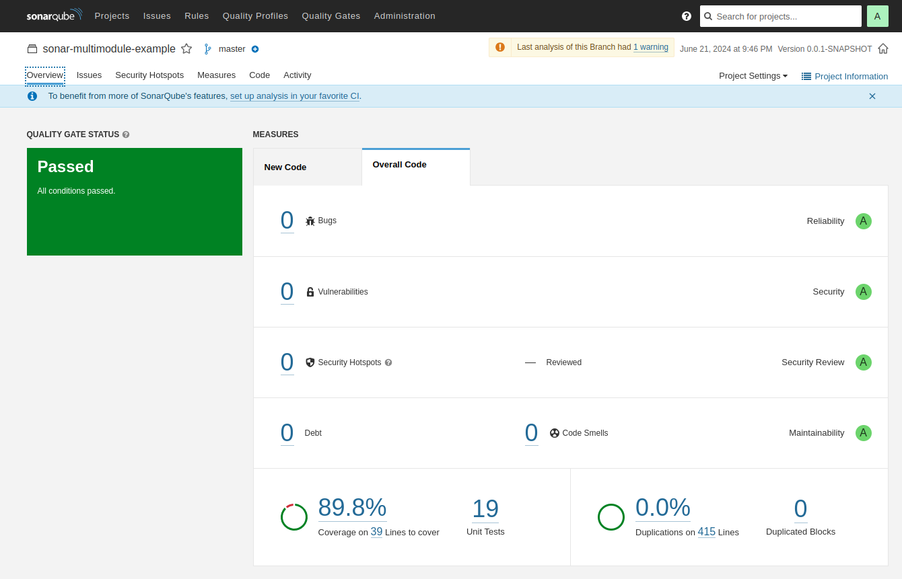

### Como rodar a aplicação

- Subir containers do docker:

```shell
docker comppose up -d
```

- Esperar servidor do sonar para gerar token de acesso

  - Depois terminar todo o processo para subir o servido, acesse http://localhost:9000, logo aparecerá essa tela, as credênciais padrão são admin/admin
  
  

  - Após o login será necesspario fornecer uma nova senha para administrador 
  
  
 
  - Nesse caso, crie um projeto manualmente, em _Manually_ 

  
  
  - Informe os dados do projeto
  
  

  - Suba o código do projeto em _Locally_

  

  - Gere o token de acesso

  

- Enviar código para o sonar:

```shell
 mvn clean install -Dsonar.login=<token_sonar>
```

Ao final, o sonarQube gera um dashboard com as informações da qualiadade do seu código

